<!-- AOC TILES BEGIN -->
<h1 align="center">
  2024 - 27 ⭐ - Rust
</h1>
<a href="src/day01.rs">
  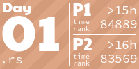
</a>
<a href="src/day02.rs">
  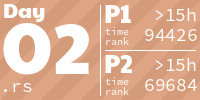
</a>
<a href="src/day03.rs">
  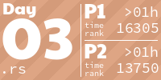
</a>
<a href="src/day04.rs">
  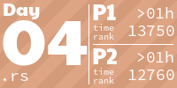
</a>
<a href="src/day05.rs">
  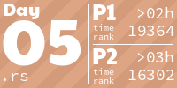
</a>
<a href="src/day06.rs">
  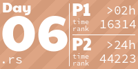
</a>
<a href="src/day07.rs">
  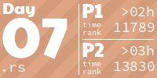
</a>
<a href="src/day08.rs">
  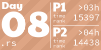
</a>
<a href="src/day09.rs">
  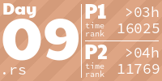
</a>
<a href="src/day10.rs">
  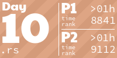
</a>
<a href="src/day11.rs">
  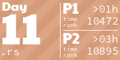
</a>
<a href="src/day12.rs">
  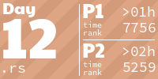
</a>
<a href="src/day13.rs">
  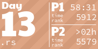
</a>
<a href="src/day14.rs">
  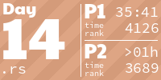
</a>
<!-- AOC TILES END -->

# Advent of code - 2024

https://adventofcode.com/2024

Second year doing it. This year, I am going to try to do it all in rust... Let's see. Not the ideal language for this, but it should be a great learning exercise.

For reference, [last year](https://github.com/dprophete/advent-2023) I started using **python**, then after a few days I restarted from day 1 using **elixir**, and after finishing it all in elixir, I redid the first 5 days in **rust**...

## running

Edit [src/main.rs](./src/main.rs) and change the day to the one you want to run. Then `cargo run` is your friend.
